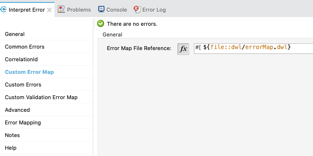

# Error Plugin for Mule 4

This custom error handler plugin allows a single module to process error messages from multiple types:
- Error types default to mule. (HTTP, APIKIT, Connectors based, etc)
- custom error types as defined by raise error component. 
- Un-clutter exceptions both in UI and XML
- User can change the custom error message (for multiple errors) in the UI rather than in the XML.
- Users intending to use other error types should put them on on-error-propagate or on-error-continue prior to using this module.
- No specific error type is required for this module. It can parse any error types.

## Operations Supported
On Error

## Deploying to Exchange
To deploy to Exchange, run the script named deploy.sh as follows,

`./deploy.sh <YOUR_ORG_ID>`

Please ensure that your settings.xml has been configured with the correct Exchange credentials so that the publish can succeed.

## Local Install
For local install, give any groupId. Issue `mvn clean install`

## Using the module in a Mule4 Project
Add this dependency to your application pom.xml

```
<dependency>
	<groupId>${groupId}</groupId>
	<artifactId>common-error-handler</artifactId>
	<version>${version}</version>
	<classifier>mule-plugin</classifier>
</dependency>
```

## Standard Error for all Schema produced by this plugin will include:

- _errorTitle_: to provide a human-readable & front-end presentable title for a given error object.
- _errorMessage_: to provide a human-readable longer explanation for the cause of the error.
- _apiName_: to provide information on the name of the API where the error occurred.
- _version_: to provide the version of the API where the error occurred.
- _developerMessage_: to provide a longer field for providing technical information on the cause of the error aimed at technical audiences.
- _errorCode_: to provide an internal error code for easy classification and categorization of errors.
- _moreInfo_: to provide a link back to additional information on the error or specific logs
- _correlationId_: to provide tracking information on the correlation ID of the initiating HTTP Request causing the error.
- _validationErrors_: an array of validation errors to specifically point out on-screen elements/user input that caused an error as it did not pass validation requirements for a given field. This will include a reason that can be displayed as a validation error message back to a user.

```
{
  "status": 400,
  "payload": "No Payload Available",
  "errors": [
    {
      "errorTitle": "Bad Request",
      "errorMessage": "There was an issue with your request message. Error is: \"Invalid value 'application/js' for header 'Content-Type'\"",
      "apiName": "ng-example-api",
      "version": "1.0.8",
      "developerMessage": null,
      "errorCode": 400,
      "moreInfo": "Bad Request : There was an issue with your request message. Error is: \"Invalid value 'application/js' for header 'Content-Type'\"",
      "correlationId": "3527d020-7e70-11ea-a2aa-38f9d3d3296a",
      "validationErrors": []
    }
  ]
}
```

## Usage

- Delete the auto-generated error blocks (on-error-propagate/on-error-continue) before using this module.
- Place the plugin inside an error block (on-error-propagate/on-error-continue) along with a variable for httpStatus.

## HTTP Listener Configuration
The error response should be changed to the following to send back the populated error message.
```
<http:listener doc:name="Listener" doc:id="1d3566ad-c8dc-4b8a-ab45-338625c74afb" config-ref="HTTP_Listener_config" path="/error">
     <http:response statusCode="#[vars.httpStatus default 200]">
         <http:headers>#[vars.outboundHeaders default {}]</http:headers>
     </http:response>
     <http:error-response statusCode="#[vars.httpStatus default 500]">
         <http:body>#[payload]</http:body>
         <http:headers>#[vars.outboundHeaders default {}]</http:headers>
     </http:error-response>
</http:listener>
```

## Tabs

### General

- Takes values for apiName and apiVersion. Current default values will be read from a property file `api.name` and `api.version` respectively.
- Error section defines from what mule expression should the error be read.
- httpStatus set variable is required to send back the httpStatus on the http response

**httpStatus variable must be set for the http listener to return on the request**


### Common Errors
Common HTTP based errors are defined in this section. Users have to provide the message they want to send back on the API error response.


### Custom Errors (`,` Delimited)

Currently due to a limitation on XML SDK, text based entries are required for custom errors. The number of entries have to match else it will fail to be successfully executed.

Currently due to a limitation on XML SDK, text based entries are required for custom errors. The number of entries have to match else it will fail to be successfully executed.

errorTitles: Have to provided as `,` separated values. Example : Example Error, Database: BAD SQL Query, Deletion Error

errorTypes: Have to provided as `,` separated values. Example : EXAMPLE:ERROR, DB:BAD\_SQL\_SYNTAX, ABC:DEF

errorCodes: Have to provided as `,` separated values. Example : 1000,2000, 3000

httpStatusCodes: Have to provided as `,` separated values. Example : 500,400, 599

errorMessages: Have to provided as `,` separated values. Example : SQL Syntax is incorrect, Testing

errorDeveloperMessages: Have to provided as `,` separated values. Example : My Example Error, SQL Syntax is incorrect, Testing

moreInfoMessages:  Have to provided as `,` separated values. Example : Additional Info,Addional Info 2, Additional Info 3


### Customer Error Map
Allows to provide a DataWeave file with a map to match to error based on error Type mule variables: error.errorType.namespace and error.errorType.identifier 



Map File should follow the following schema:

```
%dw 2.0
output application/json
---
[
	{
      "errorType":"EXAMPLE:MAP",
      "errorHttpStatus":400,
      "errorCode":1234,
      "errorMessage": "Map Error Message",
      "errorDeveloperMessage":  "Map Error Developer Message",
      "errorTitle": "Customer Error Map Error"
   }
]
```

### Customer Validation Error Map

Allows to provide a DataWeave file with a map to match to error based on error Type mule variables: error.errorType.namespace and error.errorType.identifier for the population of standard validation errors in the `validitionErrors` array.


```
output application/json
---
[
  {
      "errorType":"EXAMPLE:MAP",
      "validationErrors":[
      	{ "element":"elemnt1","invalidValue": "inavlidValue1","errorMessage": "erroMessage1"},
      	{ "element":"elemntA","invalidValue": "inavlidValueB","errorMessage": "erroMessageC"}
      ]
      
   }
]
```

### CorrelationId

A correlationId will be used for tracking transactions. The default value is #[correlationId]

## Sample Usage

### On Error With Default Errors
```
<error-handler>
	<on-error-propagate enableNotifications="true"
		logException="true" doc:name="On Error Propagate" doc:id="b995ec19-3b56-4b8e-8b0f-b172cead9be4">
		<error-handler-plugin:on-error doc:name="On error" doc:id="42db8478-b083-48b4-b31f-6638e6a6f18a" />
		<set-variable value="#[attributes.httpStatus]"
			doc:name="Set Variable" doc:id="2151ced0-a42f-4c0d-b439-455abd354277"
			variableName="httpStatus" />
	</on-error-propagate>
</error-handler>
```

### On Error With Custom Errors
```
<on-error-propagate enableNotifications="true" logException="true" doc:name="On Error Propagate" doc:id="b995ec19-3b56-4b8e-8b0f-b172cead9be4">
	<error-handler-plugin:on-error doc:name="On error" 
		doc:id="2108e03c-1a96-4dcd-976e-26d9f5f5f158" 
			errorTypes="DB:BAD_SQL_SYNTAX, ABC:DEF" 
			errorCodes="500, 599" 
			errorMessages="SQL Syntax is incorrect, Testing"/>
	<set-variable value="#[attributes.httpStatus]"
		doc:name="Set Variable" doc:id="2151ced0-a42f-4c0d-b439-455abd354277"
		variableName="httpStatus" />
</on-error-propagate>
```

## Contributors

Imtiyaz Qureshi, Salim Khan, Biswaranjan Mohanty
