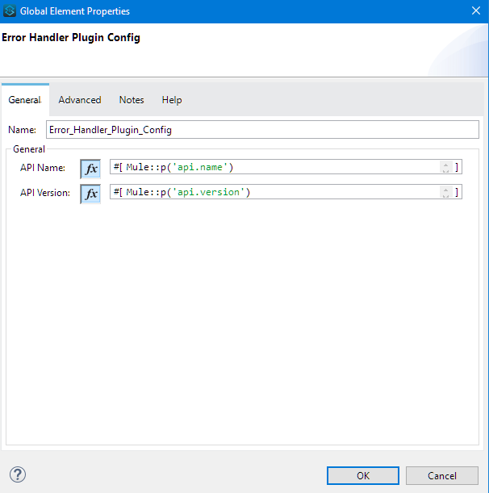
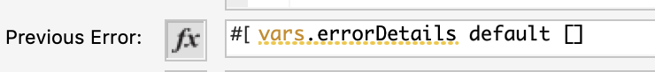
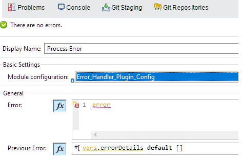
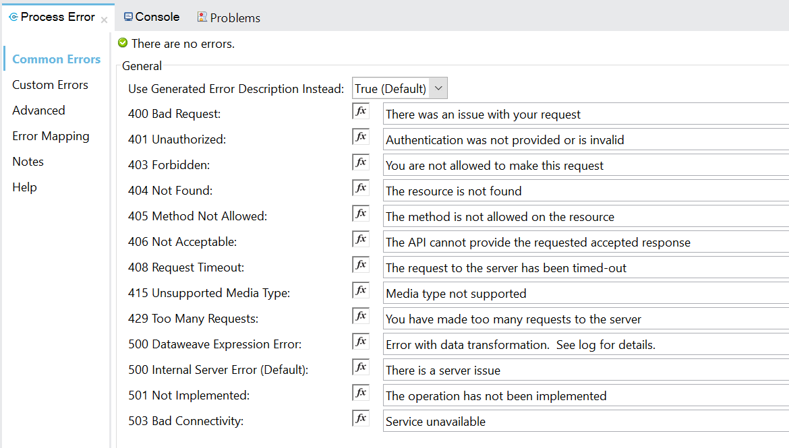
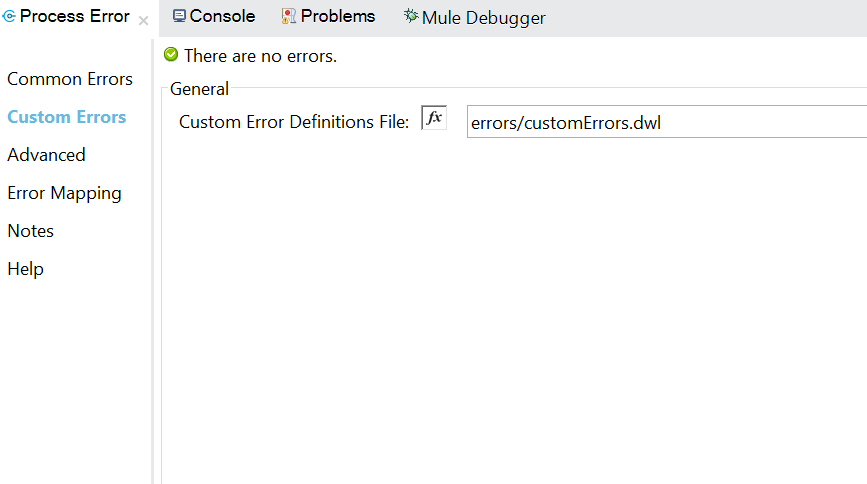

# Error Plugin for Mule 4.2.x

**This is only for minimum Mule version 4.2.0 onwards**

This custom error handler plugin allows a single module to process error messages from multiple types:
- Error types default to mule. (HTTP, APIKIT, Connectors based, etc)
- custom error types as defined by raise error component. 
- Un-clutter exceptions both in UI and XML
- User can change the custom error message (for multiple errors) in the UI rather than in the XML.
- Users intending to use other error types should put them on on-error-propagate or on-error-continue prior to using this module.
- No specific error type is required for this module. It can parse any error types.
- Propagate errors from sys/prc layer back to exp layer, cementing error propagation across layers.
- To propagate the errors, ensure the appropriate variable name is referenced in the previous error section.
- Support for Mule error components to be factored into the error message based on boolean fields.
- Using Mule Error components will give very prescriptive error messages.
- Support for debug log package: `org.mulesoft.modules.errorhandler`

## Operations Supported
On Error

## Deploying to Exchange
To deploy to Exchange, run the script named deploy.sh as follows,

`./deploy.sh <YOUR_ORG_ID>`

Please ensure that your settings.xml has been configured with the correct Exchange credentials so that the publish can succeed.

## Local Install
For local install, give any groupId. Issue `mvn clean install`

## Using the module in a Mule4 Project
Add this dependency to your application pom.xml

```
<dependency>
	<groupId>${groupId}</groupId>
	<artifactId>common-error-handler</artifactId>
	<version>${version}</version>
	<classifier>mule-plugin</classifier>
</dependency>
```

## Usage

- Delete the auto-generated error blocks (on-error-propagate/on-error-continue) before using this module.
- Place the plugin inside an error block (on-error-propagate/on-error-continue) along with a variable for httpStatus.

### Error Handler Config
Error handler application details have been moved into it's own config.


## HTTP Listener Configuration
The error response should be changed to the following to send back the populated error message.
```
<http:listener doc:name="Listener" doc:id="1d3566ad-c8dc-4b8a-ab45-338625c74afb" config-ref="HTTP_Listener_config" path="/error">
	<http:response statusCode="#[vars.httpStatus default 200]">
		<http:headers>#[vars.outboundHeaders default {}]</http:headers>
	</http:response>
	<http:error-response statusCode="#[vars.httpStatus default 500]">
		<http:body>#[payload]</http:body>
		<http:headers>#[vars.outboundHeaders default {}]</http:headers>
	</http:error-response>
</http:listener>
```

## Tabs

### General

- Takes value for the previous error message that needs to be propagated. It has to be of type `array`.

- Error section defines from what mule expression should the error be read.
- httpStatus set variable is required to send back the httpStatus on the http response

**httpStatus variable must be set for the http listener to return on the request**



### Common Errors
Common HTTP based errors are defined in this section. Users have to provide the message they want to send back on the API error response.

A boolean field `Default Error Description` has been enabled. If this is set to true, then the error message will be taken from the error description generated by Mule.

If the field is set to false, then whatever literal value is provided on the UI will be used to populate the error message.

The default value is `true`.



### Custom Errors (`,` Delimited)

Custom errors are now supported through a user defined JSON or Dataweave File. Users can provide the file through the custom error content section. The default value is `{}`.

Create a custom errors file inside src/main/resources and then reference it as shown in the image. A sample content of the file is provided below.

A copy of the file is included in the source code of the plugin. The file is called `sampleCustomErrors.dwl`.

**Sample Content**
```
%dw 2.0
output application/java
---
{
	"MULE:EXPRESSION": {
		"errorCode": 500,
		"reason": "UNKNOWN",
		"defaultError": error.description,
		"errorType": "MULE:EXPRESSION"
	},
	"UNKNOWN": {
		"errorCode": 500,
		"reason": "UNKNOWN",
		"defaultError": error.description ,
		"errorType": "MULE:EXPRESSION"
	},
	"VALIDATION:INVALID_BOOLEAN": {
		"errorCode": 500,
		"reason": "UNKNOWN",
		"defaultError": error.description, // read error from the application
		"errorType": "MULE:EXPRESSION"
	}
}
```



### CorrelationId

A correlationId will be used for tracking transactions. The default value is #[correlationId]

## Sample Usage

### On Error With Default Errors
```
<error-handler-plugin:on-error
					doc:name="Process Error"
					doc:id="5cb355ae-9e1e-4ca8-971e-a63eca2e4c54"
					config-ref="Error_Handler_Plugin_Config" />
```

### On Error With Custom Errors
```
<error-handler-plugin:on-error
					doc:name="Process Error"
					doc:id="b5304793-213f-493a-acc9-1d2d5285c39e"
					config-ref="Error_Handler_Plugin_Config">
					<error-handler-plugin:custom-errors><![CDATA[#[${file::dwl/customErrors.dwl}]]]></error-handler-plugin:custom-errors>
				</error-handler-plugin:on-error>>
```

## Contributors

Imtiyaz Qureshi, Salim Khan, Biswaranjan Mohanty
