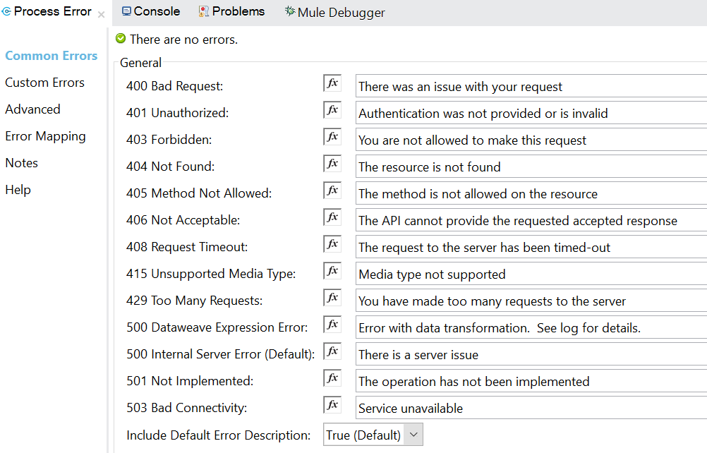
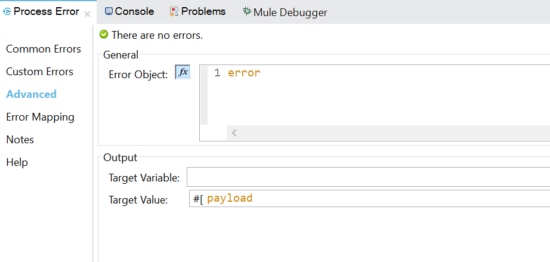

# API Error Handler

This error handler module processes any errors thrown in a flow and transforms to the correct JSON response body and HTTP status code for an API.

All APIKit and HTTP exceptions are handled by the module and can be customized in the *Common Errors* tab.  Additional error definitions can be added via DataWeave in the *Custom Errors* tab.

The error is converted by this module into the items below.

- **HTTP status code**: *Status code* from the [HTTP RFC 7231 Response Status Codes][http-rfc-7231-6] for [Client Error 4xx][http-rfc-7231-6.5] and [Server Error 5xx][http-rfc-7231-6.6].
- **JSON response body**
  - **Error status**:  *Status code*; see above.
  - **Error reason**:  *Reason phrase* from the [HTTP RFC 7231 Response Status Codes][http-rfc-7231-6] for [Client Error 4xx][http-rfc-7231-6.5] and [Server Error 5xx][http-rfc-7231-6.6].
  - **Error message**: This can be any text description, array, or object.  It is usually the Mule `error.description` or developer-defined DataWeave or text.

A JSON body response example is shown below.

**StatusCode: 400**

```
{
  "error": {
      "code": 400,
      "reason": "Bad Request",
      "message": "Error validating response"
  }
}
```

## Compatibility

- **Requires minimum Mule version: 4.3.0**
- **The XML component namespace changed due to internal requirements so previous versions of this should be deleted from an app before using this version.**

### Changes from versions previous to 6.0.0

- The XML component namespace changed to `module-error-handler-plugin`.
- The error response was simplified to only contain the error information.  The API metadata was removed and `errorDetails` was changed to `error`.  The previous error response was highly opinionated; the new response is simple and flexible to different needs.  The metadata can be added outside of this component if needed.  The API metadata is recommended to be returned via headers and not in the response body.
- There is no longer a global configuration.
- The error response fields below were removed.
    - correlationId
    - timestamp
    - apiName
    - version
    - success
- The Use Previous Error feature now replaces the error message instead of added to an array of error messages that includes the current error.
- The error, previously errorDetails, is now a single object and not an array.  The message is a string but can be customized to an array or object.

## Features

- Converts all errors into proper API JSON request body and HTTP status code.
- Customize error messages for HTTP & APIKIT errors.
- Customize error message for the default error when no errors matched: 500 - Internal Server Error.
- Provide custom error mappings with DataWeave.
- Automatically propagate errors from downstream APIs automatically, if desired.
- Automatically use the generated error description for the error response message, if desired.
- Un-clutter exceptions both in UI and XML.
- Compatible with `on-error-propagate` and  `on-error-continue` error handlers.
- All error types are parsed by this module.
- Supports strings, arrays, or objects in the `message` response field.

## Operations

### Process Error
This operation processes any exception to a proper API error response.

# Installation

This is a custom Mule module that is installed like any other connector, it is installed by adding the dependency to the pom or from "Search Exchange" button in Studio. Once installed, it will show up in the Anypoint Studio palette.

# Configuration
This section describes how to configure and use the error handler in an app.  This module does not have a separate global configuration for ease of use.

## Maven Dependency
You can find and install from Exchange in Studio.

Alternatively, you can manually add the dependency below to an app's pom.xml to include the API Error Handler in the app's maven build.  
The groupId value must be the appropriate Anypoint Org Id where the module is deployed.

```
<dependency>
    <groupId>${groupId}</groupId>
    <artifactId>api-error-handler</artifactId>
    <version>${error-handler.module.version}</version>
</dependency>
```

## App Preparation
This replaces the generated error handling so a few steps have to be done to prepare the app to use the error handler.

- Delete the APIKit's auto-generated error blocks (`on-error-propagate`/`on-error-continue`) before using this module.
- Set the outbound HTTP Status variable, `vars.httpStatus` when using APIKit, from the HTTP status attribute set by the module: `attributes.httpStatus`.  This is how the status code is sent to the caller.
- Update HTTP Listener's response values to properly use the generated body and HTTP status from the module.  See below.

### Update HTTP Listener Response

Add `vars.httpStatus` to the listener's `http:response` and `http:error-response` elements. Also make sure that the `http:error-response` element has the `payload` as its body.  These are child elements of `<http:listener>`.

```
    <http:response 
        statusCode="#[vars.httpStatus default 200]">
    </http:response>
```

```
    <http:error-response 
        statusCode="#[vars.httpStatus default 500]">
        <http:body ><![CDATA[#[payload]]]></http:body>
    </http:error-response>
```

## Error Handler Flow

Drag the *Process Error* operation from Studio's palette into the error handler to transform errors into API response.  Place the module inside an error block: `on-error-propagate`.  You usually would not use `on-error-continue` since the error handler module generates the API's error response to the caller.

Reference this error handler in the APIkit's main flow to be the top-level error handler for the API.

**Module XML**

```
<module-error-handler-plugin:process-error
    doc:name="Process Error"
    doc:id="ca10a245-319b-40c4-b6af-7de5c2ca83de" />
```

**Module XML with Custom Errors**

```
<module-error-handler-plugin:process-error
	doc:name="Process Error"
	doc:id="ca10a245-319b-40c4-b6af-7de5c2ca83de">
	<module-error-handler-plugin:custom-errors>
		<![CDATA[#[${file::errors/customErrors.dwl}]]]>
	</module-error-handler-plugin:custom-errors>
</module-error-handler-plugin:process-error>
```

### Example
An example of the full error handler flow is shown below.  This example uses the built-in logger for logging the error.


```
<error-handler name="api-error-handler">
    <on-error-propagate
        enableNotifications="true"
        logException="true"
        doc:name="On Error Propagate">
        <module-error-handler-plugin:process-error
            doc:name="Process Error"
            doc:id="ca10a245-319b-40c4-b6af-7de5c2ca83de"
            customErrorDefinition="errors/customErrors.dwl" />
        <set-variable
            variableName="httpStatus" 
            value="#[attributes.httpStatus]"
            doc:name="Set HTTP Status Code" />
        <logger
            level="ERROR"
            doc:name="Log Error"
            doc:id="93d3fc4f-cc4f-453a-be4c-2c80434bda2b"
            message='#[payload]' />
    </on-error-propagate>
</error-handler>
```

## Common Errors Tab
**Customize APIKit & HTTP Error Messages**

Modify the error message for the APIKit and HTTP errors on the *Common Errors* tab.  This field supports dataweave for dynamically generated messages if needed.
The response status code and error reason (phrase) *cannot* be changed for common errors on this tab.

- Additional errors not covered here can be mapped to the same status codes with the *Custom Errors* feature.
- If you want to change the status code or reason, use the *Custom Errors* feature to override the desired APIKit or HTTP exceptions.



### Use Generated Error Message
You can set the error message to the generated error description from the error object, `error.description`, based on the *Use Generated Error Description Instead* selection.  If it evaluates to true, the generated error will be used as the error message.  If it evaluates to false, the user-provided message will be used.  This selection only applies to common errors.  It does not apply to custom errors.  If you want to add dynamic error messages via DataWeave, then set this to `false` and add the DataWeave into the message fields.


**Note:** The only exception to using generated errors is the *DataWeave Expression Error*, which does not use the generated error description, regardless of the setting since this can be a security risk.  If you want to add the generated error to this error, you will have to explicitly do that in its message field.

## Custom Errors Tab
**Customize Full Error Definitions**

You can add any number of custom error definitions for the module to include in the mapping.  This is done by defining these custom error mappings inline or in a [DataWeave file][dataweave-file].  The screenshot shows using a file.


### Using a File

A file is recommended.  This file should be in or below `src/main/resources` folder in the Mule app.  Recommended practice is to put it in an *errors* folder: `src/main/resources/errors`.

When adding the file name to the *Custom Errors* field in the module, make sure to include the full relative path from the resources folder.
Example: if the custom errors file is `src/main/resources/errors/customErrors.dwl` then this field should be `errors/customErrors.dwl`.  The full syntax for importing a dataweave file and processing it is listed below.

```
${file::errors/customErrors.dwl}
```

### Error Format
The custom errors must be an *object of objects* with the fields below.

- Key: [Mule error type][mule-error-types] used to match.  Example: `HTTP:BAD_REQUEST`
- Value: (object)
    - `code`: HTTP status code to send in response.  This is a number.
    - `reason`: Error reason phrase to send in JSON body response.  This is a string.
    - `message`: Error details to send in JSON body response.  A string is preferred for this field, but any type is allowed.

DataWeave script is allowed in each field value.  To access the error object in this definition, you use `error` as normal. 

**Custom errors override common errors.**  If you want to override a common error's status or reason, and not just the message, you would add an entry for that error in the custom errors definition, which will completely override the common error.

A template custom error file, [examples/customErrors.dwl](./examples/customErrors.dwl), is shown below.  A custom error, `APP:SERVICE_UNAVAILABLE`, and a common error override, `HTTP:INTERNAL_SERVER_ERROR`, are shown.

```
%dw 2.0
output application/json

import * from module_error_handler_plugin::common

// Previous error nested in the Mule error object, which conforms to the API Error Handler responses.
var previousError = getPreviousErrorMessage(error)
---
{
    /*
    APP 503 Service Unavailable
    This catches custom service unavailable error from app and formats the response accordingly.
    */
    "APP:SERVICE_UNAVAILABLE": {
        "code":503,
        "reason": "Service Unavailable",
        "message": error.description
    },

    /*
    HTTP 500 Pass Through
    This catches HTTP 500 errors and propagates the detailed reason for failure.
    It uses the error.message field from the response of the HTTP call that failed, which conforms to the API Error Handler responses.
    If not found, the error.description will be returned, which generally says an internal server error occurred.
    This useful for process or experience APIs to pass through system API errors.
    */
    "HTTP:INTERNAL_SERVER_ERROR": {
        "code":500,
        "reason": "Internal Server Error",
        "message": if (!isEmpty(previousError)) previousError else error.description
    }
}
```

### Common Functions
There are some common functions provided by the module that you can use in your custom errors definition.  They are imported by `import * from module_error_handler_plugin::common`.

- `getPreviousErrorMessage`: Gets the downstream API's error message text when an error is returned from that API.  This should only used when the called API uses this same error module.  Any other response structure must be manually handled by dataweave.  It takes the error object as a parameter.  This is a great way to propagate errors up the API stack without losing the original error.

- `getErrorTypeAsString`: Gets the string for the current Mule error type.  This corresponds to the *keys* in the custom error object.  Example: `HTTP:INTERNAL_SERVER_ERROR`. 

## Advanced Tab
**General Configuration**

General configuration is defined on the *Advanced* tab.  This includes the *Error Object* definition and *Use Previous Error* feature.



### Error Object
The error object definition takes the standard [Mule Error][mule-error] by default, which is the recommended setting.  You can change this as long as the provided object has the same fields as the [Mule Error][mule-error].

### Use Previous Error
Sometimes connectors generate error responses that are generic and wrap the actual error response from the external system.  In this case, the external system's response is lost and not propagated back to the API's caller.  This happens in certain scenarios with the HTTP and Web Service Consumer connectors.

A common scenario is when a system API generates an error that needs to get propagated back to the caller of the experience or process API.  Using normal error handling, like `error.description`, the SOAP fault or `500` response from the called system is not logged or propagated.  These items are usually nested in the error object here: `error.exception.errorMessage.typedValue`.

This feature will automatically replace the `message` field for ***all errors*** with the previous error defined by the provided DataWeave if one exists.  If the previous error does not exist or is empty, then it will leave the `message` field with its current value.  This feature does not append the previous error to the current one.  It simply replaces and is best used to propagate downstream errors up the API stack.

The DataWeave should resolve to a string but any type is allowed.  The default value below resolves to a called Mule API's error message, if the message is in `error.message` in the response body, which conforms to the API Error Handler responses.

```
error.exception.errorMessage.typedValue.error.message default ''
```

**Note:** Leave this field empty if you do not want to propagate previous errors.

## Error Handling Tips

### Override the Default Error
If you want to override the default error when no errors matched (500 - Internal Server Error), use the error type `UNKNOWN` in the custom errors definition.  This allows updating the status code and reason, in addition to the message.  If you only want to change the message, update it in the *Common Errors* tab, instead of in *Custom Errors*.

```
"UNKNOWN": {
        "code":528,
        "reason": "API Error",
        "message": error.description
    }
```

### Downstream API Errors
As described in the *Use Previous Error* feature in the *Advanced* tab, sometimes it is useful to get the downstream error when it is generated from a connector.  That feature forces the downstream error propagation for all errors.

Sometimes, you only want to propagate certain errors and not all.  It is best practice to propagate `500` error message from Mule APIs up the API network.  However, you may not want to propagate the error if it was a connection or authentication issue, which may provide info that you don't want going back to the caller.

If you want to only propagate specific errors, then leave the *Use Previous Error* field empty and only put the previous error messages in specific common or custom errors.

Accessing a previous error message from a downstream API that uses the API Handler Module or conforms to its response format can be done using the `getPreviousErrorMessage` common function.  Since this requires an import statement, it's most useful in the custom errors definition.  The common error message fields are best set using the specific nested error directly: `error.exception.errorMessage.typedValue.error.message default ""` 

The example DataWeave snippet below shows how to access a called Mule API's error message for propagating, assuming that those message are in `error.message` in the response body.  It falls back to the standard error description if the previous error is not available.

```
import * from module_error_handler_plugin::common
var previousError = getPreviousErrorMessage(error)
---
```

```
	message: if (!isEmpty(previousError)) previousError else error.description
```

### List of Errors
The `message` field in the response body can be of any type.  A string is recommended, but this can also be an array of errors if needed to show history of errors across APIs.  To create an array of errors, follow the steps below.

- Create the list of errors with DataWeave in the `message` field contained in the *Custom Error* definition.  This can be done in the message fields in the *Common Error* tab for the common errors.
- Log the error in your flow while handling the array so it logs appropriately.

You can also simply set the `message` to a single string containing the merged array of errors.

### Force All Errors to 500
If you have a special, non-standard, use-case where you need to force all of the API's errors to 500 with the same error message then you can use a single custom error to override all errors.

Do this by dynamically setting the error type key with the `getErrorTypeAsString` function.  This will always match the current error.  This is should be avoided unless you have a requirement to do this. 

```
import * from module_error_handler_plugin::common
var errorType = getErrorTypeAsString(error.errorType)
---
{
    (errorType): {
        code: 500,
        reason: "Internal Service Error",
        message: error.description
    }
}
```

# Building
When building this module, the required dependencies are provided by the standard MuleSoft maven repositories. Standard maven build commands work without any additional parameters required.  This is a [Mule XML SDK][xml-sdk] module.  Use `build.sh` as described under **Deploying** below to build the module.

# Deploying

The `build.sh` script executes maven commands on the module, including deploying to Exchange.  For deploying to Anypoint Exchange or other binary repositorities, server credentials must be in your maven `settings.xml` file, and repository and server properly linked in `pom.xml`.

It takes the parameters below.

    1. Anypoint Org Id: the Anypoint business organization where to deploy the module.
    2. Build option: the type of build to execute: `local`, `deploy`.
        - `local`: builds locally (installs dependencies and module in local maven repository)
        - `deploy`: deploys module to Exchange
    
**Syntax**
```
./build.sh {Anypoint Org ID} {build option}
```

**Example**
```
./build.sh 43ae201-c97b-4665-9310-e3ac89ce1c28 deploy
```

[mule-error]: https://docs.mulesoft.com/mule-runtime/4.4/mule-error-concept
[mule-error-types]: https://docs.mulesoft.com/mule-runtime/4.4/mule-error-concept#error_types
[http-rfc-7231-6]: https://tools.ietf.org/html/rfc7231#section-6
[http-rfc-7231-6.5]: https://tools.ietf.org/html/rfc7231#section-6.5
[http-rfc-7231-6.6]: https://tools.ietf.org/html/rfc7231#section-6.6
[dataweave-file]: https://docs.mulesoft.com/mule-runtime/4.4/dataweave-language-introduction#dwl_file
[xml-sdk]: https://docs.mulesoft.com/mule-sdk/1.1/xml-sdk
